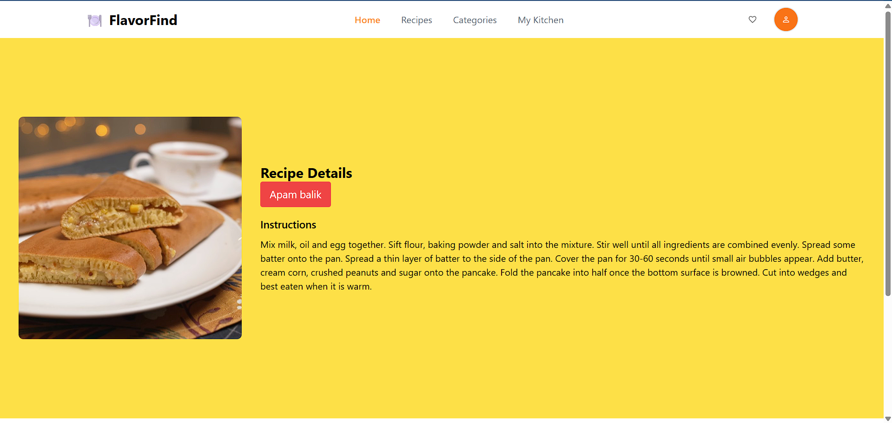
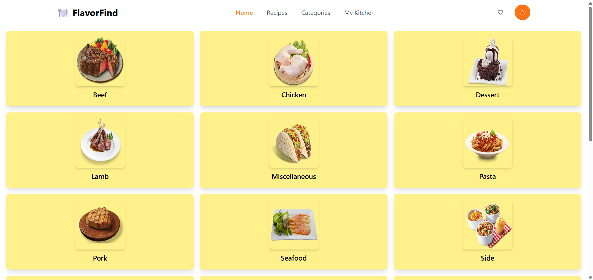

# FlavorFind


<div style="display: flex; justify-content: space-between;">
  
  
</div>

## Description

The FlavorFind App is a React-based application that allows users to search for various recipes. Users can enter a dish name (such as... cake, veg, egg, chilli, etc.) to find recipes and view detailed instructions for each meal.

## Features

- Search for meals by name.
- View detailed recipe instructions.
- Responsive design.

## Technologies Used

- React
- React Router
- CSS
- [TheMealDB API](https://www.themealdb.com/api.php)

## Installation

To get a local copy up and running, follow these steps:

1. Clone the repository:

   ```bash
   git clone https://github.com/iamaltaf786/FlavorFind.git
   cd your-repo-name

   ```

2. Install the dependencies:

   ```bash
   npm i

   ```

3. Start the development server:

   ```bash
   npm start

   ```

4. To deploy the app to GitHub Pages, run:
   ```bash
   npm run deploy
   ```

### Feel free to make any other adjustments as needed! Let me know if you need anything else.
